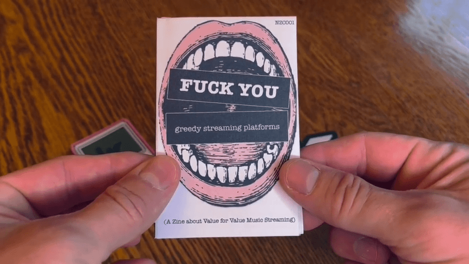
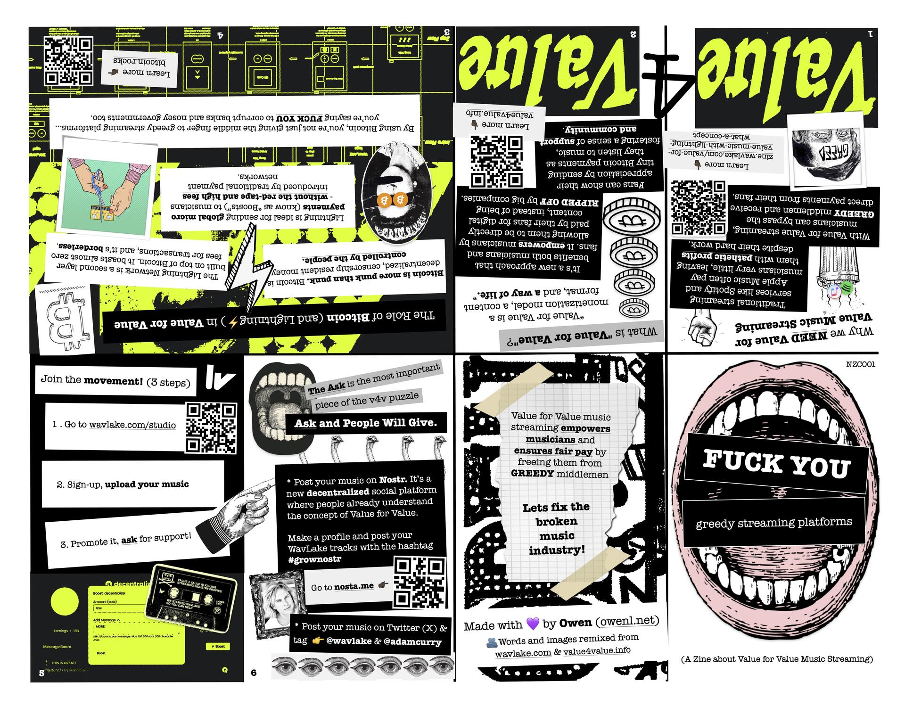
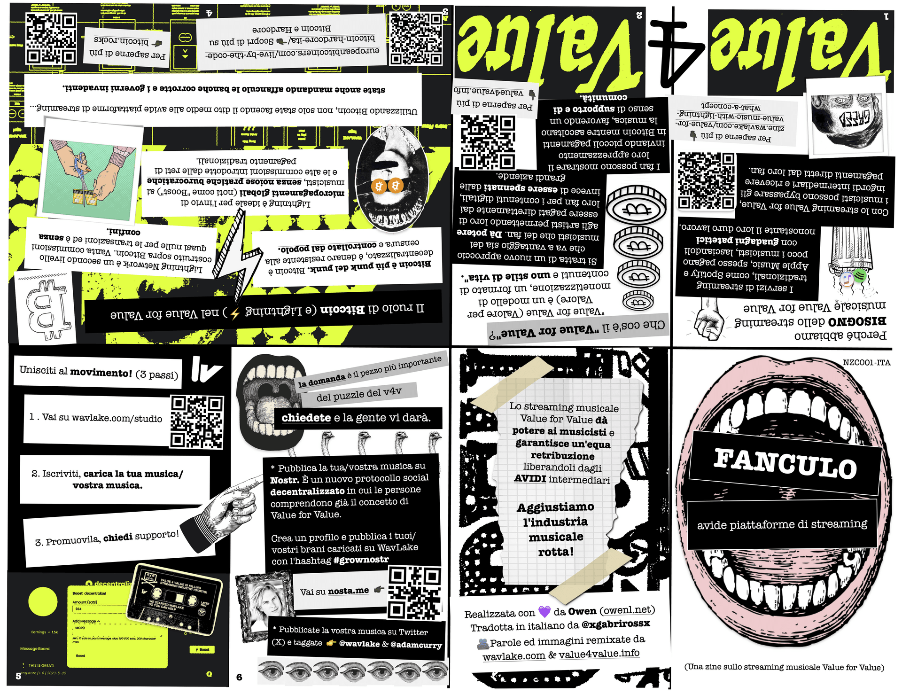
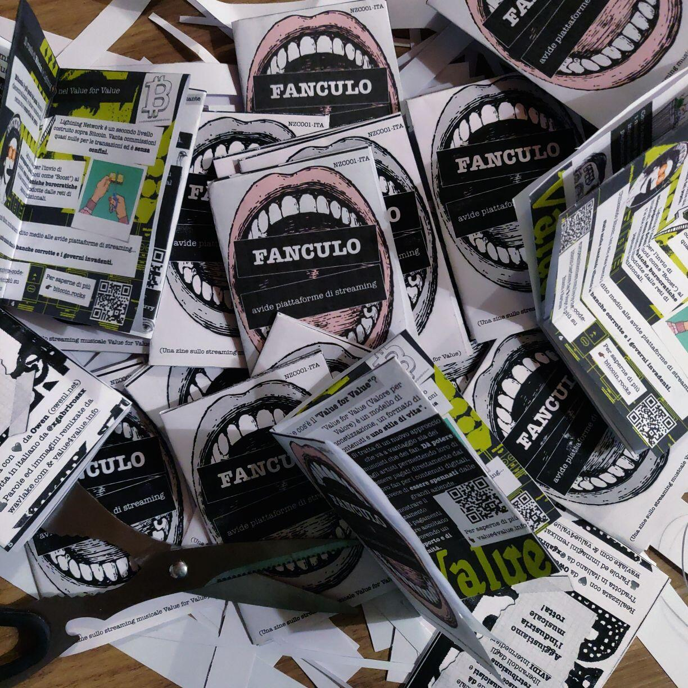
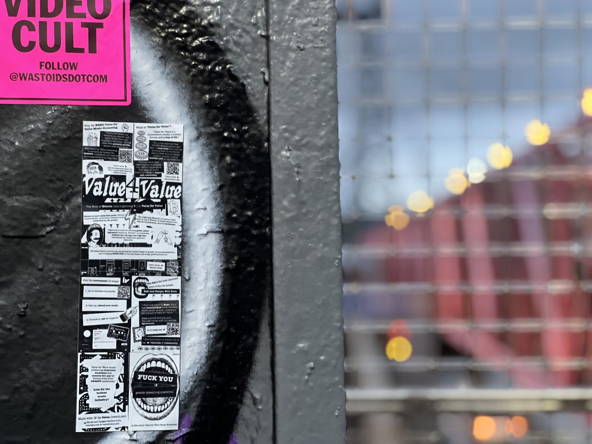
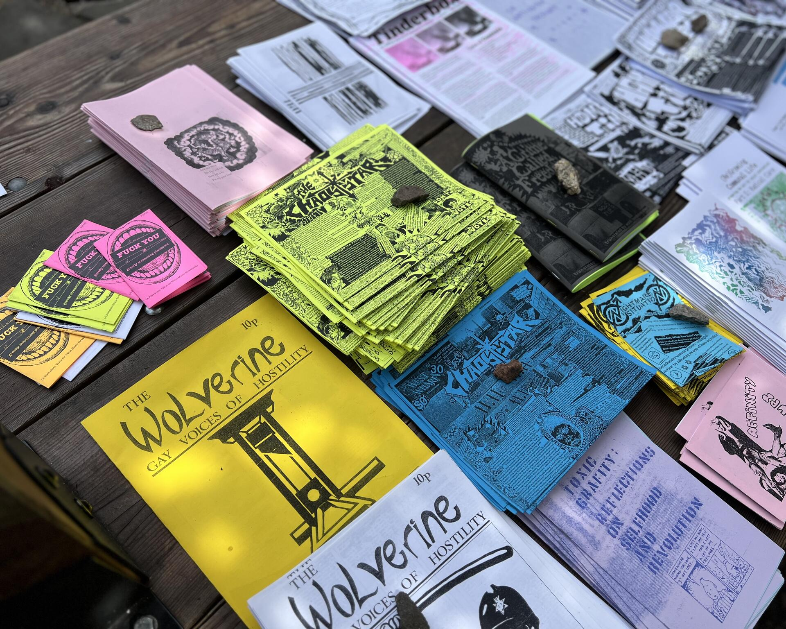

# ⚡️ Value for Value Zine ⚡️

A Value for Value / Bitcoin zine for the punk and hardcore scene

---

## Preview

Watch the preview video: [assets/v4v-zine-preview.mp4](assets/v4v-zine-preview.mp4)

---

## What Is This?

This repository archives a small DIY zine created to introduce Value for Value, Bitcoin, and Nostr to the local punk/hardcore community. The zine was designed to be:

- **Printable** on standard 8.5 x 11 paper (B&W or color OK)
- **Easy to assemble** — just cut, fold in half, distribute
- **A bridge** between DIY punk culture and the Bitcoin/Nostr ecosystem

This project remixes content from <a href="https://wavlake.com/" target="_blank" rel="noopener noreferrer">Wavlake</a> and Gigi's <a href="http://value4value.info" target="_blank" rel="noopener noreferrer">value4value.info</a>, with gratitude to Adam Curry ("the Podfather") for leadership in the v4v space.

---

## Download & Print

### 🇺🇸 English

[Plain text version →](assets/v4v-zine-eng.txt) *(coming soon)*

---

### 🇮🇹 Italiano

[Plain text version →](assets/v4v-zine-ita.txt) *(coming soon)*

**Printing instructions:** Standard 8.5 x 11 paper. Cut along outer lines, fold in half along center crease. Ready to hand out at shows.

---

## How This Started

> "Last week I had an idea after attending a local punk / hardcore show. These are the people we need to get on Value for Value, Bitcoin and Nostr."

These are young, non-conformant people with an ember of independence that needs ignition. The punk scene is already famously scrappy and DIY-centric (tape labels, zines, etc.). So the zine was created as something anyone could print and hand out at music events.

**Original announcement:** <a href="https://primal.net/e/nevent1qqs9w2k7kceg67cn9e7gj4ra2gx3zv6xlrnvqqmnuavkjlt9u30th7qa40edq" target="_blank" rel="noopener noreferrer">https://primal.net/e/nevent1qqs9w2k7kceg67cn9e7gj4ra2gx3zv6xlrnvqqmnuavkjlt9u30th7qa40edq</a>

---

## Community Distribution Stories

### Italian Translation 🇮🇹
Someone in the community translated the zine into Italian. They shared photos of piles of printed zines:
- **Translator:** <a href="https://primal.net/p/npub1tsfqcauyxr03msglk2f82wqytx76u2wdffyzymtgy4szncmujr9qx07ev5" target="_blank" rel="noopener noreferrer"><code>npub1tsfqcauyxr03msglk2f82wqytx76u2wdffyzymtgy4szncmujr9qx07ev5</code></a>
- **Post:** <a href="https://primal.net/e/nevent1qqswwkglz55hzwwmvggmampxf4nx68546p5srm53yq3lcw78f26mgkqkp7aq5" target="_blank" rel="noopener noreferrer">https://primal.net/e/nevent1qqswwkglz55hzwwmvggmampxf4nx68546p5srm53yq3lcw78f26mgkqkp7aq5</a>

### NYC Distribution 🗽
Another community member printed copies plus stickers and spread them around New York City:
- **Distributor:** <a href="https://primal.net/p/npub1eequz6v23szzyx9utphsh8kg6kll500te6sfh4vah8gdjtplcz6qg7at9s" target="_blank" rel="noopener noreferrer"><code>npub1eequz6v23szzyx9utphsh8kg6kll500te6sfh4vah8gdjtplcz6qg7at9s</code></a> (Lightning Store)
- **Post:** <a href="https://primal.net/e/nevent1qqsdlsql8qugulm3d6grwf84fu5sw3y4pzsk3l586aqkfhdwgdzwd9g2xyuxc" target="_blank" rel="noopener noreferrer">https://primal.net/e/nevent1qqsdlsql8qugulm3d6grwf84fu5sw3y4pzsk3l586aqkfhdwgdzwd9g2xyuxc</a>

---

## License & Reuse

This zine is released under the Creative Commons Attribution 4.0 International (CC BY 4.0) license. In plain terms: you are free to download, print, share, remix, translate, and reuse it for any purpose, including commercial use, as long as you give appropriate credit and link back to the original project.

If you adapt or redistribute it, please keep attribution to the Value for Value Zine project visible and mention that it originated here.

This repository is intended to be a public resource for the punk, DIY, and Bitcoin/Nostr communities.

---

## Credits & Attribution

### Original Content Sources
| Source | Contribution |
|--------|--------------|
| <a href="https://zine.wavlake.com/" target="_blank" rel="noopener noreferrer">Wavlake Blog</a> | Words & imagery foundation |
| <a href="https://value4value.info" target="_blank" rel="noopener noreferrer">value4value.info</a> (Gigi) | Core Value for Value philosophy |
| Adam Curry | Leadership acknowledgment ("Podfather") |

### Project Contributors
| Role | Identity | Notes |
|------|----------|-------|
| Creator | <a href="https://primal.net/p/npub1am50jqjytzdtepftqfzf8grh2gs4wpt7d4t90zxc6z288wqazj5skdks29" target="_blank" rel="noopener noreferrer"><code>npub1am50jqjytzdtepftqfzf8grh2gs4wpt7d4t90zxc6z288wqazj5skdks29</code></a> (Owen) | Original concept & design |
| Translator | <a href="https://primal.net/p/npub1tsfqcauyxr03msglk2f82wqytx76u2wdffyzymtgy4szncmujr9qx07ev5" target="_blank" rel="noopener noreferrer"><code>npub1tsfqcauyxr03msglk2f82wqytx76u2wdffyzymtgy4szncmujr9qx07ev5</code></a> | Italian translation |
| Distributor | <a href="https://primal.net/p/npub1eequz6v23szzyx9utphsh8kg6kll500te6sfh4vah8gdjtplcz6qg7at9s" target="_blank" rel="noopener noreferrer"><code>npub1eequz6v23szzyx9utphsh8kg6kll500te6sfh4vah8gdjtplcz6qg7at9s</code></a> (Lightning Store) | NYC prints + stickers |

---

*Archived September 2026. Found a typo? Want to translate? Open a PR or reach out via Nostr.*
⚡️ **Get this in the hands of local musicians!** ⚡️